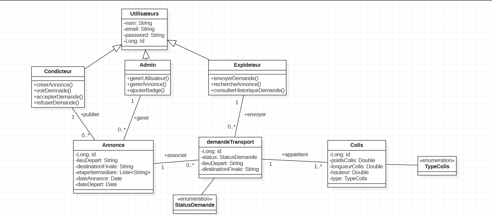

 **DeliveryMatch**
 
DeliveryMatch est une application web innovante de co-transport collaboratif mettant en relation des conducteurs et des expéditeurs de colis. L'objectif principal est d'optimiser les trajets, réduire les coûts de transport et limiter l'impact environnemental en mutualisant les livraisons.

🌍 **Objectifs du projet**

Favoriser l’économie collaborative dans le domaine du transport.

Offrir une plateforme sécurisée et fluide pour les conducteurs et les expéditeurs.

Permettre un suivi, une gestion et une transparence des trajets et colis transportés.

Proposer un dashboard d’administration pour superviser l’ensemble des activités.

**👥 Utilisateurs & Fonctionnalités**

**🔐 Utilisateurs (généraux)**

Création de compte avec nom, prénom, email, mot de passe.

Connexion sécurisée (Spring Security).

Modification des informations personnelles.

Déconnexion de la plateforme.

**🚗 Conducteurs**

Publication d'une annonce de trajet :

Lieu de départ, étapes intermédiaires, destination.

Dimensions maximales acceptées, type de marchandise, capacité disponible.

Visualisation et gestion des demandes reçues.

Acceptation ou refus des demandes selon la capacité disponible.

Historique des trajets et colis transportés.

**📦 Expéditeurs**

Recherche des trajets disponibles selon critères (destination, date, type).

Envoi d'une demande de transport avec les détails du colis (dimensions, poids, type).

Consultation de l’historique des demandes et des colis expédiés.

**🛠️ Administrateurs**

Dashboard de gestion (utilisateurs, annonces, demandes).

Validation/suspension des comptes utilisateurs, attribution d’un badge “Vérifié”.

Consultation/modification/suppression des annonces.

Statistiques de la plateforme avec Chart.js :

Nombre d’annonces.

Taux d’acceptation.

Utilisateurs actifs.

# * **Conception UML**

 **Diagramme de classe**

**Diagramme de cas d'utilisation**

**Diagrame de séquence**

